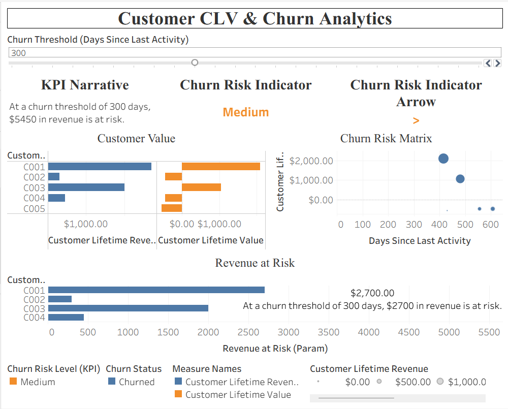
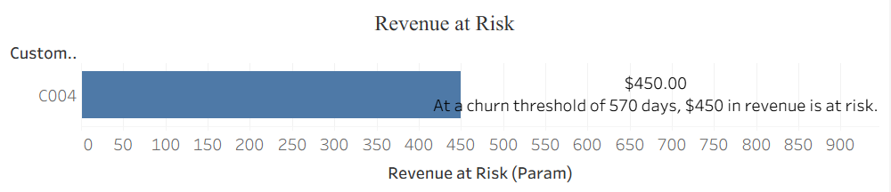

# Advanced Tableau Customer Analytics  
## Customer Lifetime Value (CLV) & Churn Risk Dashboard

## 📌 Business Problem
Subscription-based businesses need to proactively identify customers at risk of churn and understand how churn impacts revenue and customer lifetime value.  
This project analyzes customer engagement, revenue, and activity patterns to quantify **revenue at risk**, **churn likelihood**, and **customer value**, enabling data-driven retention decisions.

---

## 🎯 Project Objective
- Identify customers at risk of churn using activity-based thresholds
- Quantify **Revenue at Risk** dynamically using a parameter-driven model
- Segment customers by **Churn Risk Level (Low / Medium / High)**
- Provide executive-friendly KPIs and visual storytelling for decision-makers

---

## 📊 Key Features
- **Interactive Churn Threshold Parameter**  
  Adjusts churn logic in real time based on days since last activity
- **Customer Lifetime Value (CLV) Analysis**  
  Revenue vs value comparison by customer
- **Revenue at Risk Dashboard**  
  Highlights revenue exposure as churn threshold changes
- **Churn Risk Indicator (KPI + Arrow)**  
  Visual risk level with directional indicators
- **Churn Risk Matrix**  
  Engagement vs value scatter to prioritize retention actions
- **Dynamic KPI Narrative**  
  Automatically updates business insight text based on selections

---

## 🛠 Tools & Technologies
- Tableau Public (Dashboard Design & Analyti
- cs)
- Calculated Fields & Parameters
- Data Modeling (multi-table relationships)
- CSV-based datasets (Customers, Transactions, Engagement, Costs)

---

## 📁 Repository Structure
Advanced-Tableau-Customer-Analytics/
├── data/ # Raw datasets (CSV files)
├── tableau/ # Tableau packaged workbook (.twbx)
├── screenshots/ # Dashboard preview images
└── README.md

---

## 🔗 Live Dashboard
👉 **View on Tableau Public:**  
https://public.tableau.com/app/profile/ajay.jayshree7406/viz/Customer-CLV-and-Churn-Analytics/CustomerCLVChurnAnalytics

## 🖼 Dashboard Preview

### Overview

### Churn Risk Indicators

### Revenue at Risk Analysis

---

## 💡 Business Impact
- Enables early identification of high-risk customers
- Quantifies financial exposure from churn
- Supports retention prioritization using value-based insights
- Designed for executive and stakeholder consumption

---

## 👤 Author
**Ajay Jayshree**  
MS in Management Information Systems (MIS)  
Data Analytics | Business Intelligence | ERP Analytics

